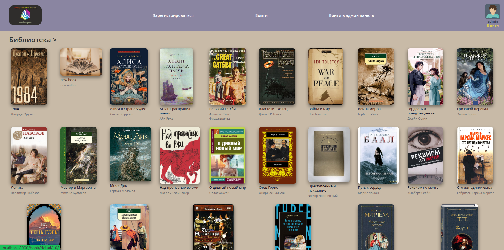

<h1 align="center">Приложение "Электронная библиотека"</h1>

<h2 align="center">Описание проекта</h2>

Это pet-проект имитирующий электронную библиотеку книг, с возможностью создания, редактирования и скачивания
файлов книг, для последующего их прочтения. Так же в проекте реализована авторизация пользователей с разграничением прав.
В проекте использованы фикстуры данных для быстрого развертывания и демонстрации возможностей.
По умолчанию добавлен супер пользователь с логином "admin", пароль "admin".

<h2 align="center">Технологии проекта</h2>
Проект выполнен с использованием следующих библиотек и баз данных:

- Flask
- docker compose
- gunicorn
- Postgresql

<h2 align="center">Развернуть проект локально</h2>
- скачиваем проект с репозитория командой git clone https://github.com/Artromterra/flask-project.git
- собираем, запускаем проект командой `docker compose build`, `docker compose up -d`
- приложение будет доступно по адресу http://localhost:8000
- для запуска тестов необходимо в файле "main/__init__.py" раскомментировать строку с тест конфигом,
и из директории test запустить команду в консоли pytest -v test.py
